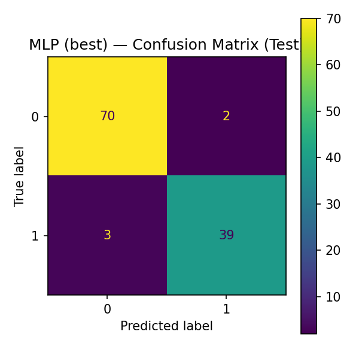
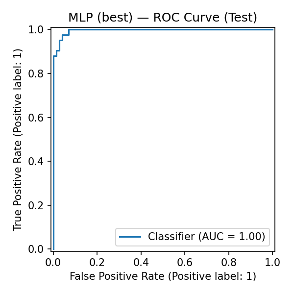

# breast-cancer-classifier


## Results (5-fold CV on training set)
| Model | Accuracy | Precision | Recall | F1 | ROC-AUC |
|---|---:|---:|---:|---:|---:|
| Neural Net (MLP) | 0.980 | 0.977 | 0.971 | 0.973 | 0.995 |
| Logistic Regression | 0.974 | 0.977 | 0.953 | 0.964 | 0.996 |
| SVM (RBF) | 0.971 | 0.977 | 0.947 | 0.961 | 0.995 |
| Gradient Boosting | 0.965 | 0.964 | 0.941 | 0.952 | 0.993 |
| Random Forest | 0.960 | 0.958 | 0.935 | 0.946 | 0.988 |

**Held-out test set (best MLP):** see `models/mlp_test_classification_report.json`.  
 

### Reproduce
```bash
python3 -m venv .venv && source .venv/bin/activate
pip install -r requirements.txt -r requirements-dev.txt
python -m src.train_model --model logreg --data data/Breast_cancer_dataset.csv --out models/
python -m src.evaluate --data data/Breast_cancer_dataset.csv --artifacts models/ --model_name logreg
# or use the tuned MLP already saved: models/mlp_best_grid.joblib


